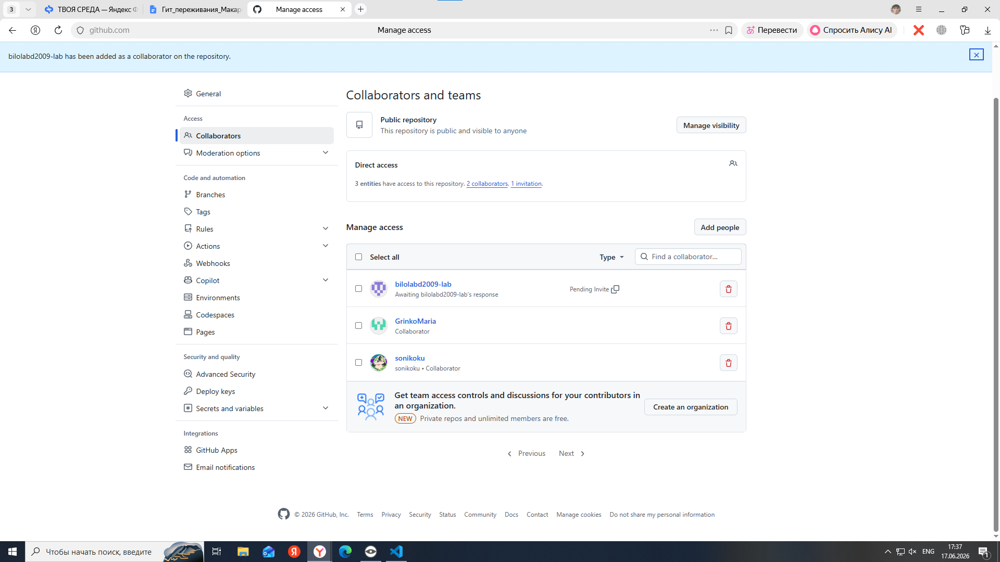
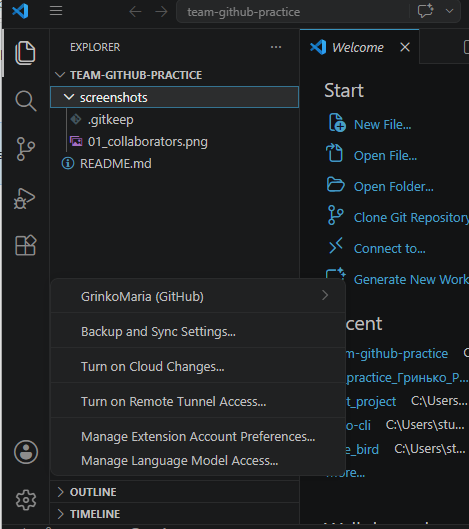
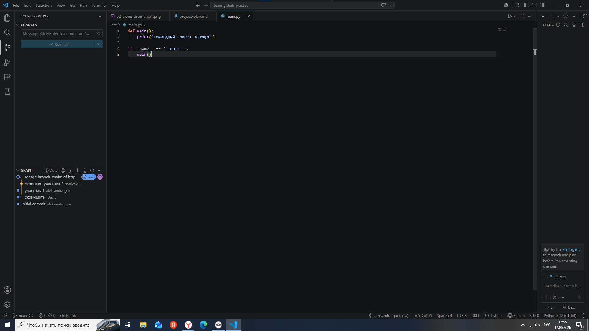
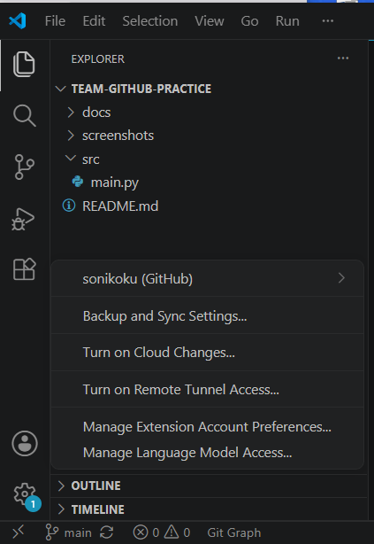

# team-github-practice

## Статус проекта

Проект находится на этапе тестирования совместной работы.

# Практическая работа: совместная разработка на GitHub

## Состав команды
| Участник | GitHub | Роль |
|----------|--------|------|
| Участник 1 | (логин) | Владелец |
| Участник 2 | GrinkoMaria | Разработчик |
| Участник 3 | (логин) | Разработчик |
| Участник 4 | (логин) | Проверяющий |

## Цель работы
Научиться работать в команде через GitHub.

## Используемые инструменты
- Git
- GitHub
- VS Code

## Ход работы

### 1. Создание репозитория и добавление участников
Владелец репозитория создал проект и добавил участников.

### 2. Клонирование проекта
Каждый участник склонировал проект.

### 3. Первый общий коммит
Участник 1 создал структуру проекта.

### 4. Получение изменений
Участники выполнили Pull.

### 5. Добавление about.md
Участник 2 добавил файл `about.md` с описанием проекта.

### 6. Работа с конфликтами (если были)
(Описание конфликта, если он возник)

### 7. Работа через ветки
Участник 2 создал ветку `feature/about-page-new` и добавил раздел про командную работу.

### 8. Pull Request
Участник 2 создал Pull Request, его проверили и слили в `main`.

### 9. Слияние Pull Request
Pull Request успешно слит и ветка удалена.

### 10. История коммитов
Финальный граф коммитов.

## Вывод
В ходе работы мы научились создавать ветки, делать коммиты, отправлять изменения на GitHub, создавать Pull Request и разрешать конфликты. Самым сложным было...

## Контрольные вопросы

1. **Что такое репозиторий?**  
   (твой ответ)

2. **Чем локальный репозиторий отличается от удаленного?**  
   (твой ответ)

3. **Что делает команда Pull?**  
   (твой ответ)

4. **Что делает команда Push?**  
   (твой ответ)

5. **Чем Fetch отличается от Pull?**  
   (твой ответ)

6. **Что такое ветка?**  
   (твой ответ)

7. **Почему не всегда удобно работать сразу в main?**  
   (твой ответ)

8. **Что такое Pull Request?**  
   (твой ответ)

9. **Зачем нужна проверка Pull Request другим участником?**  
   (твой ответ)

10. **Что такое merge conflict?**  
    (твой ответ)

11. **Почему возникает merge conflict?**  
    (твой ответ)

12. **Как понять, какой вариант кода оставить при конфликте?**  
    (твой ответ)

13. **Что будет, если забыть сделать Pull перед началом работы?**  
    (твой ответ)

14. **Почему коммиты должны быть маленькими и понятными?**  
    (твой ответ)

15. **Что было самым сложным в этой практической работе?**  
    (твой ответ)